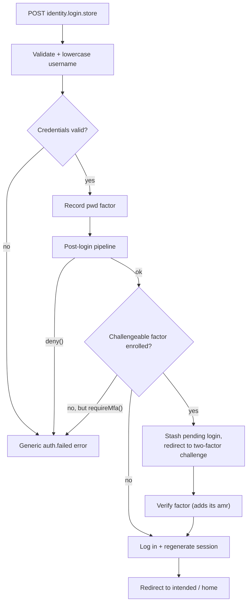

Login is owned by `AuthenticatedSessionController`, wired through two handlers that share the
`auth/login` path. Your app fills the [view seam](/auth/overview/) with `Oidc::loginView(...)`;
the package owns validation, credential checks, rate limiting, event dispatch, session
regeneration, and the hand-off to the [post-login pipeline](/auth/post-login-pipeline/) and
[multi-factor challenge](/auth/multi-factor/).

Facade registration in `boot()` is keyless-safe: it never resolves the
encrypter, so `package:discover` and other artisan runs work before an
`APP_KEY` exists.

## Routes

| Route name | Verb | Path | Middleware |
| --- | --- | --- | --- |
| `identity.login` | `GET` | `auth/login` | `web`, `guest:identity` |
| `identity.login.store` | `POST` | `auth/login` | `web`, `guest:identity`, `throttle:5,1` |

`GET identity.login` renders your bound `loginView`. If no view is bound, hitting the route throws
a `RuntimeException`.

## The login flow (`POST identity.login.store`)

The store action is throttled to **5 requests per minute** and runs the following steps:

1. **Validate.** The username field (`config('oidc.auth.username')`, default `email`) and `password`
   are both `required|string`.
2. **Normalize.** The username is **lowercased** before it is used as a credential.
3. **Verify credentials** against the `identity` guard's user provider
   (`retrieveByCredentials` + `validateCredentials`). On failure the request throws a
   `ValidationException` with the generic `auth.failed` message. Passwords are rehashed on login
   when `hashing.rehash_on_login` is enabled.
4. **Record the primary factor.** The `pwd` authentication method is recorded (it becomes part of
   the `amr` claim — see [Multi-factor](/auth/multi-factor/)).
5. **Run the [post-login pipeline](/auth/post-login-pipeline/).** A `LoginEvent` is dispatched
   through `Oidc::postLogin(...)` hooks. If a hook denies the login, the recorded factor is
   discarded and the request fails with the same generic `auth.failed` message. Queued
   `id_token`/`access_token` claims from the pipeline are stored on the session.
6. **Branch on MFA** (below).



### Success response

When no challengeable factor is enrolled, the user is logged in on the `identity` guard (honouring
the `remember` field), the **session is regenerated**, and:

- A JSON request (`wantsJson`) receives an empty **`200`** response.
- A browser request is redirected via `redirect()->intended(...)` to
  `config('oidc.auth.home')` (default `/dashboard`).

## Deferring to the two-factor challenge

After the primary factor succeeds, the package looks up the user's **confirmed, challengeable**
enrollments, filtered by `config('oidc.auth.two_factor.challenge_providers')` (default `['totp']`).

- If the [post-login pipeline](/auth/post-login-pipeline/) called `requireMfa()` but the user has
  **no** challengeable factor, the login is denied.
- If at least one challengeable enrollment exists, the login is **not** completed yet. The pending
  user id, `remember` flag, and the first enrollment's provider key and id are stashed on the
  session, and:
  - A JSON request receives `{"two_factor": true}`.
  - A browser request is redirected to `identity.two-factor.login`.

The user finishes authenticating on the [two-factor challenge](/auth/multi-factor/), which performs
the actual `guard->login()` and session regeneration once a factor is verified.

## Passkey login

Passwordless login is delegated to `laravel/passkeys` through two guest routes:

| Route name | Verb | Path | Middleware |
| --- | --- | --- | --- |
| `identity.passkey.login-options` | `GET` | `auth/passkeys/login/options` | `web`, `guest:identity`, `throttle:5,1` |
| `identity.passkey.login` | `POST` | `auth/passkeys/login` | `web`, `guest:identity`, `throttle:5,1` |

The options endpoint returns the WebAuthn assertion challenge; the browser signs it and posts the
credential back to `identity.passkey.login` to establish the session. Passkey *registration* (and
its `RequirePassword` gate) lives on the [multi-factor page](/auth/multi-factor/).

## Logout

The auth engine deliberately ships **no** `identity.logout` route — the relying party keeps
Laravel's conventional `logout` route name for itself. Log the user out of the interactive session
with the `identity` guard:

```php
use Illuminate\Support\Facades\Auth;

Route::post('/logout', function (Request $request) {
    Auth::guard(config('oidc.auth.guard'))->logout();
    $request->session()->invalidate();
    $request->session()->regenerateToken();

    return redirect('/');
})->name('logout');
```

Terminating the interactive session is separate from **OIDC RP-initiated logout** at
`/oauth/logout`, which relying parties use to end the OP session and any downstream sessions. That
endpoint and its CSRF threat model are documented under [Logout](/provider/logout/).
