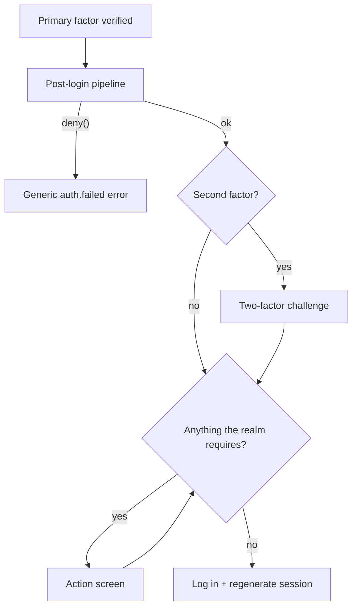

A **required action** is something the realm insists a user does before the login completes. The
package ships three — confirm your email address, replace an expired password, enroll a second
factor — and your application can add its own.

Pendency is **derived, never stored**. An action reads the state that makes it necessary and stops
reporting once that state changes. There is no row to go stale, and a realm that turns a rule on
sees it apply to users who registered long before it existed.

## The login parks rather than completes

Nothing calls `guard->login()` until the realm has nothing left to ask for. A login with an open
action returns [`LoginOutcome::RequiredAction`](/auth/login/), and **no session exists** — the same
shape the [multi-factor hand-off](/auth/multi-factor/) already had.



A browser request is redirected to the first open action's screen; a JSON request receives
`{"required_actions": ["update_password"]}`. Each screen hands back to the same check when it is
done, so several open actions are walked through in order.

## The screens are not behind the identity guard

They cannot be: mid-login there is no session yet, by design. They run behind `RequireActionSubject`
instead, which accepts **either** a session **or** a pending login and resolves the user from
whichever is there.

| Route name | Path | Action |
| --- | --- | --- |
| `identity.verification.notice` | `auth/email/verify` | `verify_email` |
| `identity.verification.verify` | `auth/email/verify/{id}/{hash}` | `verify_email` |
| `identity.verification.send` | `auth/email/verification-notification` | `verify_email` |
| `identity.password.change` | `auth/user/password` | `update_password` |
| `identity.password.change.store` | `auth/user/password` | `update_password` |
| `identity.two-factor.setup` | `auth/user/two-factor/setup` | `configure_mfa` |
| `identity.two-factor.setup.continue` | `auth/user/two-factor/setup/continue` | `configure_mfa` |

:::caution[Password confirmation is skipped mid-login]
Factor enrollment normally sits behind a re-confirmed password — that is what stops a stolen
session from locking the real owner out. Mid-login the check is skipped: there is no session to
steal yet, the user proved a credential seconds ago, and a login that arrived by
[passkey](/auth/login/#passkey-login) or an [upstream provider](/auth/social-login/) has no
password to recite. Revoking a factor keeps the confirmation in every case.
:::

## The authorization endpoint re-checks

A session established before the realm's rules caught up with it — a password that aged out, a
requirement switched on — never passed the login-time check. So `/oauth/authorize` asks again
before it issues a code or shows consent:

- with `prompt=none`, the request fails with `interaction_required` (OIDC Core §3.1.2.6)
- otherwise the user is sent to the action's screen and returned to the authorization request
  afterwards

This is what makes a required action a guarantee about **every token this provider issues**, rather
than a detail of one login screen.

## The three built-in actions

| Key | Pending when | Configured by |
| --- | --- | --- |
| `verify_email` | the user's address is unconfirmed | `oidc.auth.email_verification_required` |
| `update_password` | the password is older than the rotation window | `oidc.auth.password.max_age_days` |
| `configure_mfa` | the user has no factor that can be challenged | `oidc.auth.mfa` = `always` |

There is deliberately no separate list of enabled actions: each one's trigger is already a realm
setting, and a second switch would only be a way for the two to disagree. All three read
[`AuthenticationSettings`](/provider/realms/#realm-settings), so they can differ per realm.

`verify_email` only applies to a user model implementing `MustVerifyEmail`, and `update_password`
only to one implementing `CanResetPassword` — an action that could never be settled is never
raised.

:::note[The rotation clock starts when the package first sees a password login]
`update_password` reads `PasswordCredential::isExpired()`, which measures from the
[password history](/auth/passwords/) the package keeps. A password it has never tracked has no
clock, so turning `max_age_days` on does not expire everybody at once — each user starts their
window at their next password login.
:::

## Adding your own

Implement `RequiredAction` and append it to the registry. `isPending()` reads whatever state you
keep — an unaccepted terms version, an incomplete profile — which is why the package needs no
table for it.

```php
use Bambamboole\LaravelOidc\Server\Shared\Authentication\RequiredAction;
use Bambamboole\LaravelOidc\Server\Shared\Authentication\RequiredActionRegistry;
use Bambamboole\LaravelOidc\Server\Shared\Realms\Realm;
use Illuminate\Contracts\Auth\Authenticatable;

final readonly class AcceptTermsAction implements RequiredAction
{
    public function key(): string
    {
        return 'accept_terms';
    }

    public function isPending(Authenticatable $user, Realm $realm): bool
    {
        return $user->accepted_terms_version < $realm->id();
    }

    public function route(): string
    {
        return 'terms.show';
    }
}

// In a service provider's boot():
$this->app->make(RequiredActionRegistry::class)->register(new AcceptTermsAction);
```

Registration order is the order the user is walked through open actions.

Your screen must put the user behind `RequireActionSubject` and finish by handing back to the
login sequence:

```php
use Bambamboole\LaravelOidc\Server\Shared\Authentication\ContinuesLogin;

class TermsController
{
    use ContinuesLogin;

    public function store(Request $request)
    {
        // ... record the acceptance ...

        return $this->continueAfterAction($request, $user, 'accept_terms');
    }
}
```

`isPending()` runs on every login and every authorization request, so keep it cheap. It must not
assume a session exists; if it throws, the login is denied, because a user who never reaches the
end of the ceremony never gets a session.

## One-off actions from the post-login pipeline

A decision that applies to **one login** rather than to the account belongs in the
[post-login pipeline](/auth/post-login-pipeline/):

```php
$api->requireAction('update_password');
```

The demand lives on the session for that login only. An unregistered key is dropped and logged
rather than parking the user on a screen that does not exist.

## What this is not

There is no per-user table of assigned actions, so an administrator cannot flag one user for a
password change the way Keycloak's admin console does. Everything is derived from state. If you
need that, keep the flag on your own model and register an action that reads it — which is the
same extension point as any other.
