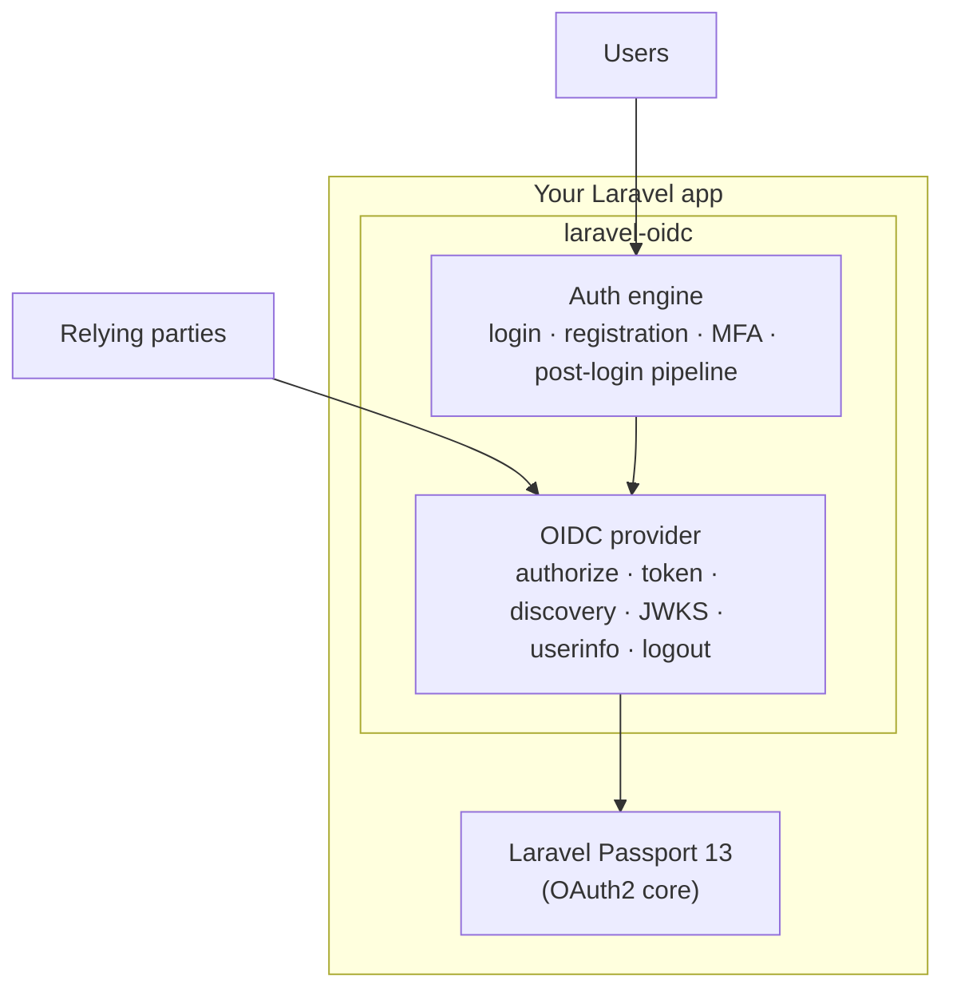

`laravel-oidc` turns a Laravel application into an **OIDC-capable auth server**: a full
OpenID Connect identity provider that other applications — relying parties — authenticate
their users against.

The **protocol layer** provides everything a relying party expects from an OP: signed
`id_token`s, a discovery document, a JWKS endpoint, `userinfo`, RP-initiated and back-channel
logout, token introspection and revocation, plus the standard OIDC scopes and claims.

On top of that, the package ships a complete **auth engine**: it owns the login, registration,
password-reset, email-verification, password-confirmation, and multi-factor flows, exposing
view and action *seams* your application fills. A consuming app drops the package in, binds
its own views and a create-user action, and gets a complete identity provider.

## Two layers, one package

The package is organized into two cooperating layers you can adopt together or piecemeal:

- **The OIDC provider** — the protocol endpoints and token machinery. Usable on its own if you
  already have your own authentication (e.g. Fortify) and only need the OIDC surface.
- **The auth engine** — package-owned authentication flows with view/action seams. Use it when
  you want the package to own login, registration, and MFA as well.

## Built on Passport

The OAuth2 core underneath is **Laravel Passport 13** — the package extends and reconfigures
it rather than reimplementing an authorization server.

On registration the package calls `Passport::ignoreRoutes()` and registers the **full
`/oauth/*` route surface itself** from the unified `oidc.handlers` config. This means:

- The authorization, token, approve/deny, and token-refresh routes are registered by this
  package using its own controllers (so `max_age`, OIDC scopes, and the `id_token` response
  type are wired in).
- **PKCE (`code_challenge`) is required on every authorization request**, per OAuth 2.1
  §4.1.1/§7.6 — for confidential clients as well as public ones. A request missing it is
  rejected with `invalid_request`.
- **Passport's optional JSON API management routes are *not* registered** (client CRUD,
  personal-access-token management, scope listing, etc.). If your app relies on those, register
  them yourself.
- The access-token entity is swapped to `OidcAccessToken` and the authorization-server response
  type to `IdTokenResponse`.

The package also registers a dedicated **`identity` guard** (session driver, `users` provider
by default) and routes the interactive authorization and auth-engine flows through it, so
everything shares one consistent guard.

## Where to go next

- [Installation](/introduction/installation/) — install, publish migrations, generate keys.
- [Configuration](/introduction/configuration/) — every `config/oidc.php` key.
- [Endpoints & discovery](/provider/endpoints/) — the protocol surface.
- [Auth engine overview](/auth/overview/) — the view/action seams.
