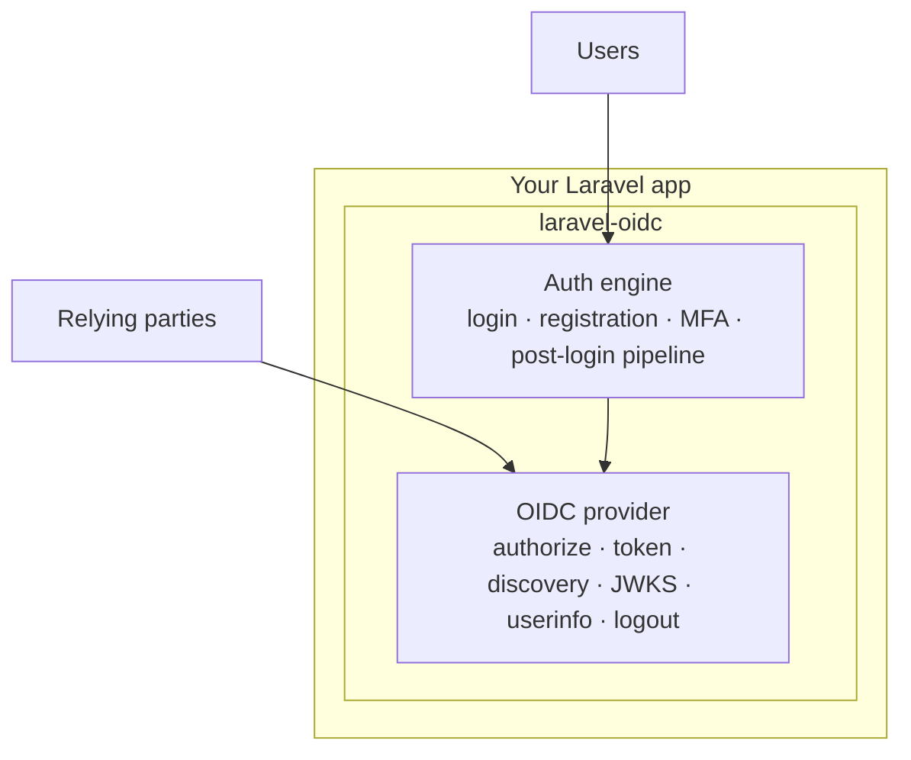

`laravel-oidc` turns a Laravel application into an **OIDC-capable auth server**: a full
OpenID Connect identity provider that other applications — relying parties — authenticate
their users against.

The **protocol layer** provides everything a relying party expects from an OP: signed
`id_token`s, a discovery document, a JWKS endpoint, `userinfo`, RP-initiated and back-channel
logout, token introspection and revocation, plus the standard OIDC scopes and claims.

On top of that, the package ships a complete **auth engine**: it owns the login, registration,
password-reset, email-verification, password-confirmation, and multi-factor flows, exposing
view and action *seams* your application fills. A consuming app drops the package in, binds
its own views and a create-user action, and gets a complete identity provider.

## Two layers, one package

The package is organized into two cooperating layers you can adopt together or piecemeal:

- **The OIDC provider** — the protocol endpoints and token machinery. Usable on its own if you
  already have your own authentication and only need the OIDC surface.
- **The auth engine** — package-owned authentication flows with view/action seams. Use it when
  you want the package to own login, registration, and MFA as well.

```mermaid
flowchart TB
    Users["Users"] --> AE
    RP["Relying parties"] --> OP
    subgraph App["Your Laravel app"]
        direction TB
        subgraph Pkg["laravel-oidc"]
            AE["Auth engine<br/>login · registration · MFA · post-login pipeline"]
            OP["OIDC provider<br/>authorize · token · discovery · JWKS · userinfo · logout"]
        end
    end
    AE --> OP
```

## A package-owned OAuth2 core

The package implements the OAuth 2.1 / OpenID Connect core itself: client authentication, the
authorization request, authorization codes with PKCE, refresh-token rotation, and the token
endpoint's grants live in the `Protocol` domain on top of the package's own tables and models.
This means:

- The authorization, token and approve/deny routes are registered by this package using its own
  controllers, so `max_age`, `prompt`, OIDC scopes and the `id_token` are wired in.
- **PKCE with `S256` is required on every authorization request**, per OAuth 2.1 §4.1.1/§7.6 —
  for confidential clients as well as public ones. A request missing it is answered with an
  `invalid_request` error on the client's redirect URI.
- Authorization codes and refresh tokens are opaque, single-use database records. A replayed code
  or a reused refresh token revokes every token that descends from it.
- The signing key is read on every request, so a key rotation takes effect without restarting
  the workers.
- No client-management JSON API ships with the package. Provision clients with
  `oidc:client`, or through [dynamic client registration](/provider/dynamic-client-registration/).

The package also registers a dedicated **`identity` guard** (session driver, `users` provider
by default) and routes the interactive authorization and auth-engine flows through it, so
everything shares one consistent guard.

## Where to go next

- [Installation](/introduction/installation/) — install, publish migrations, generate keys.
- [Configuration](/introduction/configuration/) — every `config/oidc.php` key.
- [Endpoints & discovery](/provider/endpoints/) — the protocol surface.
- [Auth engine overview](/auth/overview/) — the view/action seams.
