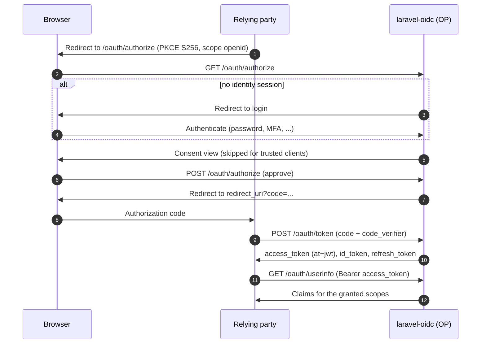

The provider registers the full OAuth2/OIDC endpoint surface itself from
`config('oidc.handlers')`. Each protocol endpoint below is a single entry in that map — see
[Route handlers](/introduction/route-handlers/) for how to customize, disable, or re-point it.

## Endpoints

| Endpoint | Route | Purpose |
| --- | --- | --- |
| Discovery | `GET /.well-known/openid-configuration` | OIDC provider metadata |
| JWKS | `GET /.well-known/jwks.json` | Public signing keys (RS256) |
| Authorize | `GET /oauth/authorize` | Authorization request (PKCE `S256` required) |
| Token | `POST /oauth/token` | Token endpoint (all grants) |
| UserInfo | `GET\|POST /oauth/userinfo` | Claims for the bearer token |
| End session | `GET\|POST /oauth/logout` | RP-initiated logout — see [Logout](/provider/logout/) |
| Introspection | `POST /oauth/introspect` | RFC 7662 token introspection (client-authenticated) |
| Revocation | `POST /oauth/revoke` | RFC 7009 token revocation (client-authenticated) |

UserInfo, End session, Introspection, and Revocation can each be toggled off by setting its
handler to `false` in `config('oidc.handlers')` (`oidc.userinfo`, `oidc.logout`,
`oidc.introspect`, `oidc.revoke`). When an endpoint is disabled it is also dropped from the
discovery document.

## The authorization code flow

How the endpoints fit together for an interactive login:



## The UserInfo endpoint

UserInfo authenticates the bearer token against the guard named by `config('oidc.api_guard')`
(default `api`), and requires the `openid` scope. The claims it returns are the token's granted
scopes resolved through the `ClaimsResolver` — see [Scopes & claims](/provider/scopes-and-claims/).

## What discovery advertises

`GET /.well-known/openid-configuration` returns a document built entirely from the configured
`issuer` origin — every endpoint URL is derived from that origin, **not** the incoming request's
host — and is served with `Cache-Control: max-age=3600, public`. The fixed metadata it publishes:

| Field | Value |
| --- | --- |
| `response_types_supported` | `["code"]` |
| `response_modes_supported` | `["query"]` |
| `grant_types_supported` | `authorization_code`, `refresh_token`, `client_credentials`, plus the device-code URN when Passport's device-code grant is enabled, plus `urn:ietf:params:oauth:grant-type:token-exchange` when token exchange is enabled |
| `subject_types_supported` | `["public"]` |
| `id_token_signing_alg_values_supported` | `["RS256"]` |
| `code_challenge_methods_supported` | `["S256"]` |
| `claims_parameter_supported` | `false` |
| `request_parameter_supported` | `false` |
| `request_uri_parameter_supported` | `false` |
| `backchannel_logout_supported` | `true` |
| `backchannel_logout_session_supported` | `true` |
| `token_endpoint_auth_methods_supported` | `["client_secret_basic", "client_secret_post", "none"]` |

`scopes_supported` is the non-hidden catalogue from the `ScopeRepository`, and `claims_supported`
comes from `config('oidc.claims_supported')`.

The `userinfo_endpoint`, `end_session_endpoint`, `introspection_endpoint`, and
`revocation_endpoint` keys appear only when their handlers are enabled. When present, the
introspection and revocation entries each also advertise an
`*_endpoint_auth_methods_supported` of `["client_secret_basic", "client_secret_post"]`.

## Consent view (required)

The authorization endpoint needs a consent view to render. Registration goes through
Passport (which owns the authorization view seam) via `Passport::authorizationView()`,
typically in a service provider `boot()`:

```php
use Laravel\Passport\Passport;

Passport::authorizationView(function (array $parameters) {
    return view('oauth.authorize', [
        'client' => $parameters['client'],
        'user' => $parameters['user'],
        'scopes' => $parameters['scopes'],
        'request' => $parameters['request'],
        'authToken' => $parameters['authToken'],
    ]);
});
```

The view posts `auth_token` back to `POST /oauth/authorize` to approve, or sends
`DELETE /oauth/authorize` to deny.
