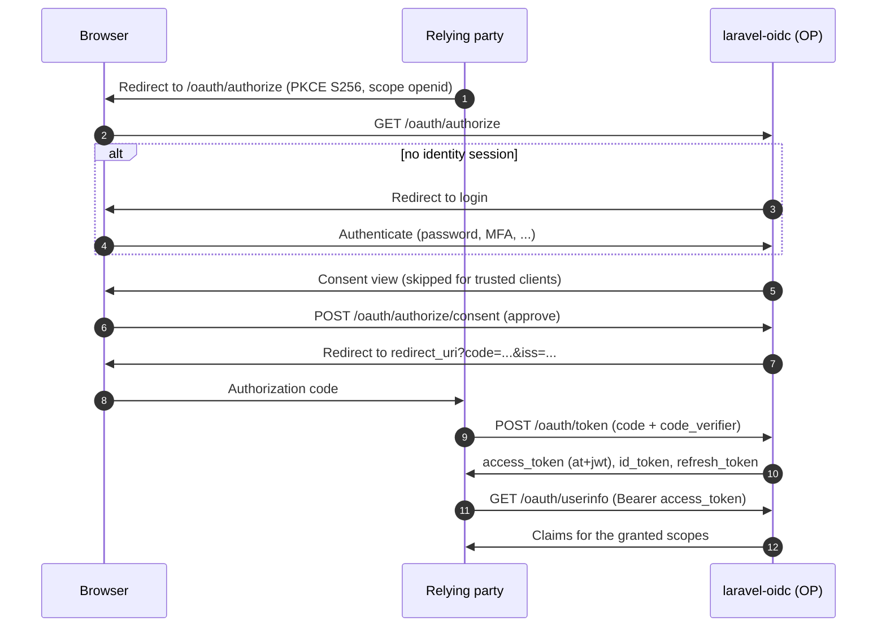

The provider registers the full OAuth2/OIDC endpoint surface itself. Every endpoint carries a
stable route name — see [Routes](/introduction/route-handlers/) for how to replace a controller.
The paths below are those of a single-realm deployment; with `oidc.routes.realms` set to `path`
every one of them moves below `/realms/{realm}`, see [Realms](/provider/realms/).

## Endpoints

| Endpoint | Route | Purpose |
| --- | --- | --- |
| Discovery | `GET /.well-known/openid-configuration` | OIDC provider metadata |
| AS metadata | `GET /.well-known/oauth-authorization-server/{path?}` | RFC 8414 authorization server metadata (same document as Discovery) |
| Protected resource | `GET /.well-known/oauth-protected-resource/{path?}` | RFC 9728 protected resource metadata — see [Dynamic client registration & MCP](/provider/dynamic-client-registration/) |
| JWKS | `GET /.well-known/jwks.json` | Public signing keys (RS256) |
| Authorize | `GET\|POST /oauth/authorize` | Authorization request (PKCE `S256` required) |
| Consent | `POST\|DELETE /oauth/authorize/consent` | Approve (`POST`) or deny (`DELETE`) the pending authorization request |
| Token | `POST /oauth/token` | Token endpoint (all grants) |
| Register | `POST /oauth/register` | RFC 7591 dynamic client registration (disabled by default) |
| UserInfo | `GET\|POST /oauth/userinfo` | Claims for the bearer token |
| End session | `GET\|POST /oauth/logout` | RP-initiated logout — see [Logout](/provider/logout/) |
| Introspection | `POST /oauth/introspect` | RFC 7662 token introspection (client-authenticated) |
| Revocation | `POST /oauth/revoke` | RFC 7009 token revocation (client-authenticated) |

Registration (`oidc.register`) is gated behind `config('oidc.clients.registration.enabled')` and only
registered — and advertised as `registration_endpoint` in both metadata documents — when that
flag is on.

The AS metadata and protected resource documents are not prefixed by the realm: RFC 8414 §3.1
and RFC 9728 §3.1 build those URLs by inserting the well-known segment ahead of the issuer's
path, so the realm follows it instead. OpenID Connect Discovery appends, which is why
`/.well-known/openid-configuration` is the prefixed one.

## The authorization code flow

How the endpoints fit together for an interactive login:


```mermaid
sequenceDiagram
    autonumber
    participant B as Browser
    participant RP as Relying party
    participant OP as laravel-oidc (OP)

    RP->>B: Redirect to /oauth/authorize (PKCE S256, scope openid)
    B->>OP: GET /oauth/authorize
    alt no identity session
        OP->>B: Redirect to login
        B->>OP: Authenticate (password, MFA, ...)
    end
    OP->>B: Consent view (skipped for trusted clients)
    B->>OP: POST /oauth/authorize/consent (approve)
    OP->>B: Redirect to redirect_uri?code=...&iss=...
    B->>RP: Authorization code
    RP->>OP: POST /oauth/token (code + code_verifier)
    OP->>RP: access_token (at+jwt), id_token, refresh_token
    RP->>OP: GET /oauth/userinfo (Bearer access_token)
    OP->>RP: Claims for the granted scopes
```

## The authorization endpoint

The endpoint accepts `GET` and `POST` (OpenID Connect Core §3.1.2.1). Parameters are read from
the query string on `GET` and from the `application/x-www-form-urlencoded` body on `POST`; the two
are never merged. `POST /oauth/authorize` is exempt from the `web` group's request
forgery check because clients submit it cross-site.

The request is validated before anything touches the session. `client_id` and `redirect_uri` are
checked first: an unknown or missing `client_id`, a missing `redirect_uri` (when more than one is
registered), or one that does not match a registration is answered with HTTP 400 and a JSON
`invalid_request` body — never a redirect and never a `WWW-Authenticate` challenge. Every later
failure is reported as an error redirect to the validated `redirect_uri`, with `state` echoed.

| Parameter | Behaviour |
| --- | --- |
| Any parameter more than once | `invalid_request` (OAuth 2.1 §4.1.1). Without a redirect if the duplicate is `client_id` or `redirect_uri` |
| `response_type` other than `code` | `unsupported_response_type` |
| `response_mode` other than `query` | `invalid_request`; the response mode is never silently substituted |
| `request` / `request_uri` | `request_not_supported` / `request_uri_not_supported` (OpenID Connect Core §6) |
| `code_challenge` missing, `code_challenge_method` other than `S256` | `invalid_request` |
| `scope` naming an unknown scope, or a known scope the client is not assigned | `invalid_scope` |
| `max_age` | Non-negative integer. A login older than that (or without a recorded `auth_time`) is renewed: the session is ended and the user sent to login. With `prompt=none` the answer is `login_required` and the session is kept |
| `prompt` | `none`, `login`, `consent`, `select_account`. `none` combined with any other value, or an unknown value, is `invalid_request`. `login` ends the session and sends the user to login. `select_account` behaves exactly like `login`: the provider holds one account per browser session, so there is no account to switch to. `consent` shows the consent view even when a stored consent already covers the requested scopes; trusted first-party clients ignore it |
| `id_token_hint` | Must verify against the realm's signing keys and issuer, otherwise `invalid_request`. When the hint's `sub` is not the signed-in user the answer is `login_required`; a signed-out user proceeds to login (`login_required` with `prompt=none`) |
| `acr_values` | Stored for the post-login pipeline — see [Post-login pipeline](/auth/post-login-pipeline/) |

Every response sent to the `redirect_uri` — the code and each error — carries the realm's issuer
as `iss` (RFC 9207 §2).

## The token endpoint

Every successful response carries `token_type`, `expires_in`, `access_token` and — whenever the
token has any — `scope`, the space-delimited set actually granted (RFC 6749 §5.1). The granted set
can be narrower than the requested one (consent, client restrictions, refresh narrowing), so a
client reads its scopes from the response rather than assuming the request went through
unchanged. `refresh_token` and `id_token` follow when the grant produces them.

An authorization code is bound to the client it was issued to: another client presenting it gets
`invalid_grant`, and the code's own client keeps its tokens. Only the code's client replaying it
revokes the tokens the code produced (OAuth 2.1 §4.1.3).

## The UserInfo endpoint

UserInfo authenticates the bearer token against the guard named by `config('oidc.auth.api_guard')`
(default `oidc`), and requires the `openid` scope. The claims it returns are the token's granted
scopes resolved through the `ClaimsResolver` — see [Scopes & claims](/provider/scopes-and-claims/).
`sub` is always the authenticated user's identifier (OpenID Connect Core §5.3.2); a resolver
returning `sub` or any other protocol claim (`iss`, `aud`, `exp`, `iat`, `nbf`, `jti`, `nonce`,
`at_hash`, `c_hash`, `auth_time`, `azp`, `acr`, `amr`, `sid`) has that claim dropped, in the
id_token as well as here.

A request without a bearer token is answered with `401` and `WWW-Authenticate: Bearer realm="…",
resource_metadata="…"` and no body; a rejected token with `401 invalid_token` — see
[Resource servers](/advanced/resource-servers/) for the challenge format.

## Introspection and revocation

Both endpoints take `token` and an optional `token_type_hint`. A missing or empty `token` is
`400 invalid_request` (RFC 7662 §2.3, RFC 7009 §2.2.1). The hint only orders the lookup: the
hinted type is tried first, the other one after it, and a hint the provider does not know
(anything other than `access_token` or `refresh_token`) is ignored. A refresh token presented as
`access_token`, or the other way round, is therefore still found.

Introspection (`POST /oauth/introspect`) is limited to confidential clients. The
client the token was issued to may introspect it, and so may any client named in an access
token's `aud`. Everything else — an unknown, expired, revoked, or another client's token — is
`{"active": false}`. An active access token reports `active`, `token_type` (`Bearer`), `scope`,
`client_id`, `sub` (omitted for a client-credentials token), `exp`, `iat`, `nbf`, `jti`, `iss`
and `aud` (always an array); an active refresh token reports `active`, `scope`, `client_id`,
`sub`, `exp` (the refresh token's own expiry) and `iss`, and no `token_type`.

Revocation (`POST /oauth/revoke`) is open to public clients too, so a browser or
native app can revoke its own refresh token. Revoking either token of a pair revokes both (RFC 7009
§2.1). A token that is unknown or belongs to another client is ignored with `200`, so the endpoint
never confirms whether a token existed.

## What discovery advertises

`GET /.well-known/openid-configuration` returns a document built entirely from the configured
`issuer` origin — every endpoint URL is derived from that origin, **not** the incoming request's
host — and is served with `Cache-Control: max-age=3600, public`. The fixed metadata it publishes:

| Field | Value |
| --- | --- |
| `response_types_supported` | `["code"]` |
| `response_modes_supported` | `["query"]` |
| `grant_types_supported` | `authorization_code`, `refresh_token`, `client_credentials`, plus `urn:ietf:params:oauth:grant-type:token-exchange` when token exchange is enabled |
| `subject_types_supported` | `["public"]` |
| `id_token_signing_alg_values_supported` | `["RS256"]` |
| `code_challenge_methods_supported` | `["S256"]` |
| `claims_parameter_supported` | `false` |
| `request_parameter_supported` | `false` |
| `request_uri_parameter_supported` | `false` |
| `authorization_response_iss_parameter_supported` | `true` |
| `backchannel_logout_supported` | `true` |
| `backchannel_logout_session_supported` | `true` |
| `token_endpoint_auth_methods_supported` | `["client_secret_basic", "client_secret_post", "none"]` |

`scopes_supported` is the non-hidden catalog from the `ScopeRepository` across the realm and every
registered resource, and `claims_supported`
comes from `config('oidc.claims_supported')`.

A client authenticates with exactly the method it is registered for (`token_endpoint_auth_method`):
clients provisioned by the package use `client_secret_post` when confidential and `none` when
public; dynamically registered clients use the method they registered. Presenting a secret through both the
`Authorization` header and the request body is rejected as `invalid_request`.

The `userinfo_endpoint`, `end_session_endpoint`, `introspection_endpoint`, and
`revocation_endpoint` keys appear only when their handlers are enabled. Introspection is limited
to confidential clients (`["client_secret_basic", "client_secret_post"]`); revocation also accepts
public clients (`none`) — see [Introspection and revocation](#introspection-and-revocation).

## Consent view (required)

The authorization endpoint needs a consent view to render. It resolves through the `ConsentView`
contract (`Bambamboole\LaravelOidc\Server\Consents\Views\ConsentView`), lazily — only when consent
is actually shown. Bind the contract:

```php
use Bambamboole\LaravelOidc\Server\Consents\Views\ConsentPrompt;
use Bambamboole\LaravelOidc\Server\Consents\Views\ConsentView;
use Illuminate\Http\Request;

app()->bind(ConsentView::class, fn () => new class implements ConsentView {
    public function respond(ConsentPrompt $prompt, Request $request)
    {
        return view('oauth.authorize', [
            'client' => $prompt->client,
            'user' => $prompt->user,
            'scopes' => $prompt->scopes,
            'authToken' => $prompt->authToken,
        ]);
    }
});
```

Without a binding, the default throws `MissingAuthViewException` — install
`bambamboole/laravel-oidc-ui` (which binds it, among the other auth views) or bind it
yourself.

The view posts `auth_token` back to `POST /oauth/authorize/consent` (route
`oidc.approve`) to approve, or sends `DELETE /oauth/authorize/consent` (route
`oidc.deny`) to deny.

### What is remembered

An approval is stored in `oidc_consents`: one row per realm, user and client, holding the union of
every scope set the user approved for that client. The scopes in play are the requested ones plus
the client's [default scopes](/provider/scopes-and-claims/#client-scope-assignment); hidden scopes
are granted without being shown. The authorization endpoint skips the view when that row covers
every scope in play, and shows it again when the request asks for a scope the row does not hold —
approving then merges the new scopes in. A denial stores nothing.

The consent is independent of the tokens it led to: it survives their expiry and their revocation.
It ends only when it is withdrawn, which sets `revoked_at` and brings the view back on the next
request; approving again re-activates the same row.

```php
use Bambamboole\LaravelOidc\Server\Consents\ConsentRepository;

app(ConsentRepository::class)->revoke((string) $user->getAuthIdentifier(), $client);
```

Trusted first-party clients and clients with `consent_required` set to false never see the view
and store no consent. `prompt=consent` shows the view regardless of a stored consent.
