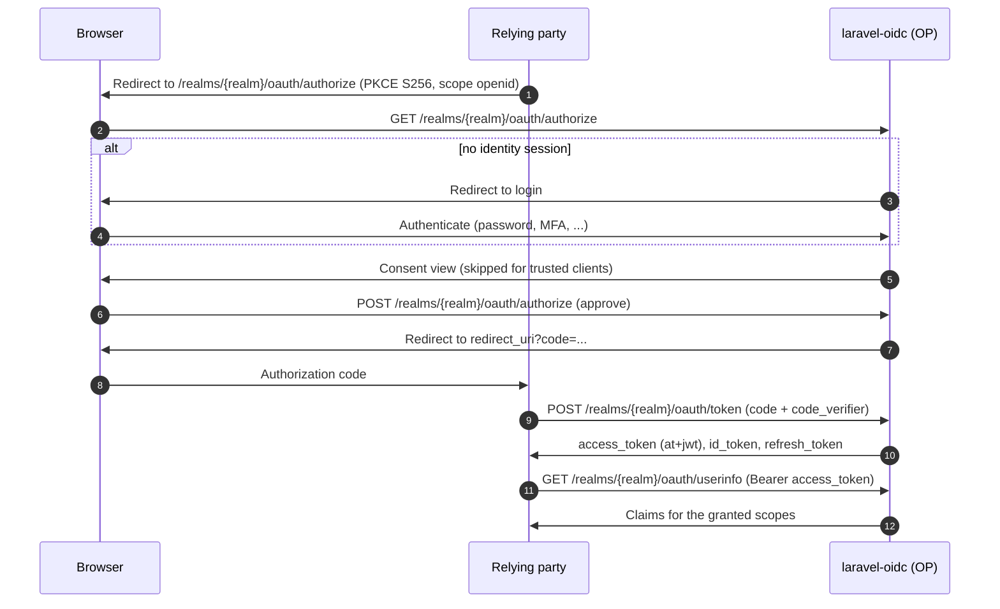

The provider registers the full OAuth2/OIDC endpoint surface itself. Every endpoint sits below
the realm prefix and carries a stable route name — see [Routes](/introduction/route-handlers/)
for how to replace a controller, and [Realms](/provider/realms/) for the prefix itself.

## Endpoints

| Endpoint | Route | Purpose |
| --- | --- | --- |
| Discovery | `GET /realms/{realm}/.well-known/openid-configuration` | OIDC provider metadata |
| AS metadata | `GET /.well-known/oauth-authorization-server/realms/{realm}/{path?}` | RFC 8414 authorization server metadata (same document as Discovery) |
| Protected resource | `GET /.well-known/oauth-protected-resource/realms/{realm}/{path?}` | RFC 9728 protected resource metadata — see [Dynamic client registration & MCP](/provider/dynamic-client-registration/) |
| JWKS | `GET /realms/{realm}/.well-known/jwks.json` | Public signing keys (RS256) |
| Authorize | `GET /realms/{realm}/oauth/authorize` | Authorization request (PKCE `S256` required) |
| Token | `POST /realms/{realm}/oauth/token` | Token endpoint (all grants) |
| Register | `POST /realms/{realm}/oauth/register` | RFC 7591 dynamic client registration (disabled by default) |
| UserInfo | `GET\|POST /realms/{realm}/oauth/userinfo` | Claims for the bearer token |
| End session | `GET\|POST /realms/{realm}/oauth/logout` | RP-initiated logout — see [Logout](/provider/logout/) |
| Introspection | `POST /realms/{realm}/oauth/introspect` | RFC 7662 token introspection (client-authenticated) |
| Revocation | `POST /realms/{realm}/oauth/revoke` | RFC 7009 token revocation (client-authenticated) |

Registration (`oidc.register`) is gated behind `config('oidc.dcr.enabled')` and only
registered — and advertised as `registration_endpoint` in both metadata documents — when that
flag is on.

The AS metadata and protected resource documents are not prefixed by the realm: RFC 8414 §3.1
and RFC 9728 §3.1 build those URLs by inserting the well-known segment ahead of the issuer's
path, so the realm follows it instead. OpenID Connect Discovery appends, which is why
`/realms/{realm}/.well-known/openid-configuration` is the prefixed one.

## The authorization code flow

How the endpoints fit together for an interactive login:


```mermaid
sequenceDiagram
    autonumber
    participant B as Browser
    participant RP as Relying party
    participant OP as laravel-oidc (OP)

    RP->>B: Redirect to /realms/{realm}/oauth/authorize (PKCE S256, scope openid)
    B->>OP: GET /realms/{realm}/oauth/authorize
    alt no identity session
        OP->>B: Redirect to login
        B->>OP: Authenticate (password, MFA, ...)
    end
    OP->>B: Consent view (skipped for trusted clients)
    B->>OP: POST /realms/{realm}/oauth/authorize (approve)
    OP->>B: Redirect to redirect_uri?code=...
    B->>RP: Authorization code
    RP->>OP: POST /realms/{realm}/oauth/token (code + code_verifier)
    OP->>RP: access_token (at+jwt), id_token, refresh_token
    RP->>OP: GET /realms/{realm}/oauth/userinfo (Bearer access_token)
    OP->>RP: Claims for the granted scopes
```

## The UserInfo endpoint

UserInfo authenticates the bearer token against the guard named by `config('oidc.api_guard')`
(default `oidc`), and requires the `openid` scope. The claims it returns are the token's granted
scopes resolved through the `ClaimsResolver` — see [Scopes & claims](/provider/scopes-and-claims/).

## What discovery advertises

`GET /realms/{realm}/.well-known/openid-configuration` returns a document built entirely from the configured
`issuer` origin — every endpoint URL is derived from that origin, **not** the incoming request's
host — and is served with `Cache-Control: max-age=3600, public`. The fixed metadata it publishes:

| Field | Value |
| --- | --- |
| `response_types_supported` | `["code"]` |
| `response_modes_supported` | `["query"]` |
| `grant_types_supported` | `authorization_code`, `refresh_token`, `client_credentials`, plus `urn:ietf:params:oauth:grant-type:token-exchange` when token exchange is enabled |
| `subject_types_supported` | `["public"]` |
| `id_token_signing_alg_values_supported` | `["RS256"]` |
| `code_challenge_methods_supported` | `["S256"]` |
| `claims_parameter_supported` | `false` |
| `request_parameter_supported` | `false` |
| `request_uri_parameter_supported` | `false` |
| `backchannel_logout_supported` | `true` |
| `backchannel_logout_session_supported` | `true` |
| `token_endpoint_auth_methods_supported` | `["client_secret_basic", "client_secret_post", "none"]` |

`scopes_supported` is the non-hidden catalog from the `ScopeRepository`, and `claims_supported`
comes from `config('oidc.claims_supported')`.

The `userinfo_endpoint`, `end_session_endpoint`, `introspection_endpoint`, and
`revocation_endpoint` keys appear only when their handlers are enabled. When present, the
introspection and revocation entries each also advertise an
`*_endpoint_auth_methods_supported` of `["client_secret_basic", "client_secret_post"]`.

## Consent view (required)

The authorization endpoint needs a consent view to render. It resolves through the `ConsentView`
contract (`Bambamboole\LaravelOidc\Server\Forms\ConsentView`), lazily — only when consent
is actually shown. Bind the contract:

```php
use Bambamboole\LaravelOidc\Server\Forms\ConsentPrompt;
use Bambamboole\LaravelOidc\Server\Forms\ConsentView;
use Illuminate\Http\Request;

app()->bind(ConsentView::class, fn () => new class implements ConsentView {
    public function respond(ConsentPrompt $prompt, Request $request)
    {
        return view('oauth.authorize', [
            'client' => $prompt->client,
            'user' => $prompt->user,
            'scopes' => $prompt->scopes,
            'authToken' => $prompt->authToken,
        ]);
    }
});
```

Without a binding, the default throws `MissingAuthViewException` — install
`bambamboole/laravel-oidc-ui` (which binds it, among the other auth views) or bind it
yourself.

The view posts `auth_token` back to `POST /realms/{realm}/oauth/authorize` to approve, or sends
`DELETE /realms/{realm}/oauth/authorize` to deny.
