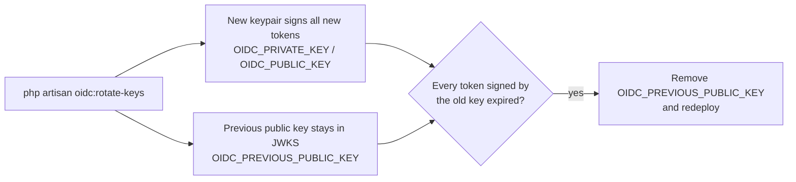

The signing key lives entirely in environment variables — no key files on disk, no database:

| Variable | Role |
| --- | --- |
| `OIDC_PRIVATE_KEY` | Signs tokens |
| `OIDC_PUBLIC_KEY` | Published in JWKS |
| `OIDC_PREVIOUS_PUBLIC_KEY` | The last rotated-out public key, kept in JWKS during the overlap |

:::note
When the `OIDC_*` variables are unset, key resolution falls back to Passport's
`PASSPORT_PRIVATE_KEY`/`PASSPORT_PUBLIC_KEY` and finally to its `oauth-*.key` files — so an
app that generated keys with `passport:keys` keeps working unchanged.
:::

## Rotating

Generate a keypair with:

```bash
php artisan oidc:rotate-keys
```

- Writes `OIDC_PRIVATE_KEY`, `OIDC_PUBLIC_KEY`, and `OIDC_PREVIOUS_PUBLIC_KEY` into your
  `.env` (as quoted, `\n`-escaped single-line values), rolling the *current* public key into
  `OIDC_PREVIOUS_PUBLIC_KEY` so tokens signed before the rotation keep validating.
- Prompts for confirmation first; pass `--force` to skip it.
- Pass `--print` to print the three variables to stdout instead of writing `.env` — use this when
  your keys come from a secrets manager rather than a file. `--print` never touches `.env`.
- Restart the app (and queue workers) afterwards so the new keys load.

For a first-time setup (no existing key), the command simply writes a fresh
`OIDC_PRIVATE_KEY`/`OIDC_PUBLIC_KEY` and omits `OIDC_PREVIOUS_PUBLIC_KEY`.



## The overlap window

`OIDC_PREVIOUS_PUBLIC_KEY` flows into `config('oidc.additional_public_keys')`, which the JWKS
endpoint serves alongside the active key (deduplicated by `kid`). During the overlap, tokens
signed by either the current or the previous key verify.

Once every token signed by the previous key has expired (i.e. past your access-/id-token TTL),
remove `OIDC_PREVIOUS_PUBLIC_KEY` and redeploy. The old **private** key is already gone after
rotation, so it can never sign new tokens — leaving the old public key in JWKS a little too long is
harmless, not a security hole.
