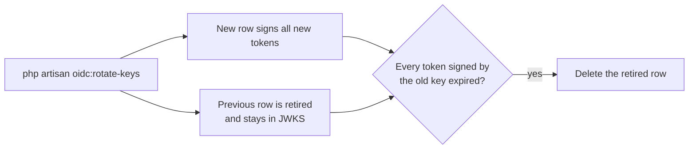

The signing keypair lives in the `oidc_signing_keys` table, one row per key and realm, with the
private key encrypted at rest through Eloquent's `encrypted` cast. Exactly one row per realm is
active and signs; every retired row stays in JWKS under its own `kid`, so tokens issued before a
rotation keep verifying. The key is read on every request, so a rotation takes effect without
restarting workers.

## Generating and rotating

```bash
php artisan oidc:rotate-keys --if-missing   # first-time setup: only when no key exists
php artisan oidc:rotate-keys                # rotation: prompts, --force skips the prompt
```

A rotation stamps `retired_at` on the active row and inserts a new one. The `kid` is persisted,
so it stays stable for the life of the key.


```mermaid
flowchart LR
    A["php artisan oidc:rotate-keys"] --> B["New row signs all new tokens"]
    A --> C["Previous row is retired<br/>and stays in JWKS"]
    B --> D{"Every token signed by<br/>the old key expired?"}
    C --> D
    D -- yes --> E["Delete the retired row"]
```

## The overlap window

During the overlap, tokens signed by either the current or a retired key verify, and the JWKS
endpoint serves every key. Once every token signed by a retired key has expired (past your
access-/id-token TTL), delete its row. A retired row carries a private key that never signs
again, so leaving it a little too long is harmless, not a security hole.

## A custom store

All key material — signing, verification, JWKS — resolves through the
`Bambamboole\LaravelOidc\Server\Shared\SigningKeys\SigningKeyStore` contract:

```php
interface SigningKeyStore
{
    /** The key new tokens are signed with. */
    public function signingKey(): SigningKeyPair;

    /** @return non-empty-list<SigningKeyPair> The signing key first, then every retained key. */
    public function verificationKeys(): array;

    /** Persist a new keypair, retaining the current one for verification. */
    public function rotate(GeneratedSigningKeys $keys): void;
}
```

A `SigningKeyPair` carries the public PEM, an optional private PEM, and an optional `kid`. When no
`kid` is given it is derived from the public key per RFC 7638, so a store that has no `kid` of its
own can omit it. Entries returned from `verificationKeys()` need no private key.

Point the config at your class, for a KMS or vault:

```php
'keys' => [
    'store' => App\Oidc\VaultSigningKeyStore::class,
],
```

The store is resolved from the container as a **singleton**, and singletons such as
`AccessTokenMinter` hold it for their lifetime. Read any request-dependent state inside the
methods rather than capturing it in the constructor, and cache inside the store if the backend
lookup is slow — `signingKey()` and `verificationKeys()` are called on every issuance and
verification.

## Testing

A host-app test needs a signing key before it can mint tokens. The `InteractsWithOidc` trait's
`installSigningKey()` generates a keypair once per process and stores it whenever the key store
is empty, so it can run in `setUp()` under `RefreshDatabase`.
