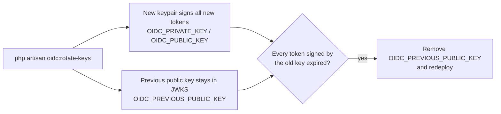

By default the signing key lives entirely in environment variables — no key files on disk, no database:

| Variable | Role |
| --- | --- |
| `OIDC_PRIVATE_KEY` | Signs tokens |
| `OIDC_PUBLIC_KEY` | Published in JWKS |
| `OIDC_PREVIOUS_PUBLIC_KEY` | The last rotated-out public key, kept in JWKS during the overlap |

:::note
When the `OIDC_*` variables are unset, key resolution falls back to Passport's
`PASSPORT_PRIVATE_KEY`/`PASSPORT_PUBLIC_KEY` and finally to its `oauth-*.key` files — so an
app that generated keys with `passport:keys` keeps working unchanged.
:::

## Rotating

Generate a keypair with:

```bash
php artisan oidc:rotate-keys
```

- Writes `OIDC_PRIVATE_KEY`, `OIDC_PUBLIC_KEY`, and `OIDC_PREVIOUS_PUBLIC_KEY` into your
  `.env` (as quoted, `\n`-escaped single-line values), rolling the *current* public key into
  `OIDC_PREVIOUS_PUBLIC_KEY` so tokens signed before the rotation keep validating.
- Prompts for confirmation first; pass `--force` to skip it.
- Pass `--print` to print the three variables to stdout instead of writing `.env` — use this when
  your keys come from a secrets manager rather than a file. `--print` never touches `.env`.
- Restart the app (and queue workers) afterwards so the new keys load.

For a first-time setup (no existing key), the command simply writes a fresh
`OIDC_PRIVATE_KEY`/`OIDC_PUBLIC_KEY` and omits `OIDC_PREVIOUS_PUBLIC_KEY`.


```mermaid
flowchart LR
    A["php artisan oidc:rotate-keys"] --> B["New keypair signs all new tokens<br/>OIDC_PRIVATE_KEY / OIDC_PUBLIC_KEY"]
    A --> C["Previous public key stays in JWKS<br/>OIDC_PREVIOUS_PUBLIC_KEY"]
    B --> D{"Every token signed by<br/>the old key expired?"}
    C --> D
    D -- yes --> E["Remove OIDC_PREVIOUS_PUBLIC_KEY<br/>and redeploy"]
```

## The overlap window

`OIDC_PREVIOUS_PUBLIC_KEY` flows into `config('oidc.additional_public_keys')`, which the default env key store exposes as its previous public keys; the JWKS endpoint serves them alongside the active key (deduplicated by `kid`). During the overlap, tokens
signed by either the current or the previous key verify.

Once every token signed by the previous key has expired (i.e. past your access-/id-token TTL),
remove `OIDC_PREVIOUS_PUBLIC_KEY` and redeploy. The old **private** key is already gone after
rotation, so it can never sign new tokens — leaving the old public key in JWKS a little too long is
harmless, not a security hole.

## Production key storage

`oidc:rotate-keys` writes to `.env`, which is often read-only in production. Two ways out:

- `oidc:rotate-keys --print` prints the three variables for your secrets manager, and you deploy them yourself.
- Bind your own `SigningKeyStore` implementation, and rotation persists wherever you point it — no `.env` write involved.

The package resolves all key material (signing, verification, JWKS) through the
`Bambamboole\LaravelOidc\Server\Token\SigningKeyStore` contract:

```php
interface SigningKeyStore
{
    public function privateKey(): string;

    public function publicKey(): string;

    /** @return list<string> Retired public keys still valid for verification/JWKS */
    public function previousPublicKeys(): array;

    /** Persist a new keypair, rolling the current public key into the previous set. */
    public function rotate(GeneratedSigningKeys $keys): void;
}
```

A database-backed example with the private key encrypted at rest
(table: `oidc_signing_keys` — `kid` string, `private_key` text, `public_key` text,
`created_at` / `retired_at` timestamps):

```php
use Bambamboole\LaravelOidc\Server\Token\GeneratedSigningKeys;
use Bambamboole\LaravelOidc\Server\Token\SigningKeyStore;
use Illuminate\Support\Facades\Crypt;
use Illuminate\Support\Facades\DB;
use RuntimeException;

class DatabaseSigningKeyStore implements SigningKeyStore
{
    public function privateKey(): string
    {
        return Crypt::decryptString($this->current()->private_key);
    }

    public function publicKey(): string
    {
        return $this->current()->public_key;
    }

    public function previousPublicKeys(): array
    {
        return DB::table('oidc_signing_keys')
            ->whereNotNull('retired_at')
            ->orderByDesc('retired_at')
            ->pluck('public_key')
            ->all();
    }

    public function rotate(GeneratedSigningKeys $keys): void
    {
        DB::transaction(function () use ($keys): void {
            DB::table('oidc_signing_keys')->whereNull('retired_at')->update(['retired_at' => now()]);
            DB::table('oidc_signing_keys')->insert([
                'kid' => $keys->kid,
                'private_key' => Crypt::encryptString($keys->privateKeyPem),
                'public_key' => $keys->publicKeyPem,
                'created_at' => now(),
            ]);
        });
    }

    private function current(): object
    {
        return DB::table('oidc_signing_keys')->whereNull('retired_at')->first()
            ?? throw new RuntimeException('No active OIDC signing key. Run `php artisan oidc:rotate-keys`.');
    }
}
```

Bind it in a service provider:

```php
$this->app->singleton(SigningKeyStore::class, DatabaseSigningKeyStore::class);
```

`oidc:rotate-keys` then persists through your store, and the JWKS endpoint,
token signing, and verification all read from it. Keys are resolved on every
request — cache inside your store if the backend lookup is slow. Delete retired
rows once every token they signed has expired, exactly like removing
`OIDC_PREVIOUS_PUBLIC_KEY`.
