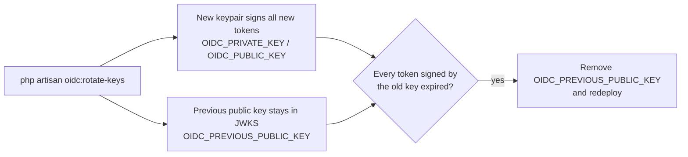

By default the signing key lives entirely in environment variables — no key files on disk, no database. A [database-backed store](#the-database-store) ships alongside it and is selected via `oidc.keys.store`.

| Variable | Role |
| --- | --- |
| `OIDC_PRIVATE_KEY` | Signs tokens |
| `OIDC_PUBLIC_KEY` | Published in JWKS |
| `OIDC_PREVIOUS_PUBLIC_KEY` | The last rotated-out public key, kept in JWKS during the overlap |

:::note
When the `OIDC_*` variables are unset, key resolution falls back to an
`oauth-private.key`/`oauth-public.key` pair in `oidc.keys.path` (`storage_path()` by default),
so an app that keeps its keypair on disk works unchanged.
:::

## Rotating

Generate a keypair with:

```bash
php artisan oidc:rotate-keys
```

- Writes `OIDC_PRIVATE_KEY`, `OIDC_PUBLIC_KEY`, and `OIDC_PREVIOUS_PUBLIC_KEY` into your
  `.env` (as quoted, `\n`-escaped single-line values), rolling the *current* public key into
  `OIDC_PREVIOUS_PUBLIC_KEY` so tokens signed before the rotation keep validating.
- Prompts for confirmation first; pass `--force` to skip it.
- Pass `--print` to print the three variables to stdout instead of writing `.env` — use this when
  your keys come from a secrets manager rather than a file. `--print` never touches `.env`.
- Restart the app (and queue workers) afterwards so the new keys load.

For a first-time setup (no existing key), the command simply writes a fresh
`OIDC_PRIVATE_KEY`/`OIDC_PUBLIC_KEY` and omits `OIDC_PREVIOUS_PUBLIC_KEY`.


```mermaid
flowchart LR
    A["php artisan oidc:rotate-keys"] --> B["New keypair signs all new tokens<br/>OIDC_PRIVATE_KEY / OIDC_PUBLIC_KEY"]
    A --> C["Previous public key stays in JWKS<br/>OIDC_PREVIOUS_PUBLIC_KEY"]
    B --> D{"Every token signed by<br/>the old key expired?"}
    C --> D
    D -- yes --> E["Remove OIDC_PREVIOUS_PUBLIC_KEY<br/>and redeploy"]
```

## The overlap window

`OIDC_PREVIOUS_PUBLIC_KEY` flows into `config('oidc.keys.additional_public_keys')`, which the default env
key store returns as retained verification keys; the JWKS endpoint serves them alongside the active
key (deduplicated by `kid`). During the overlap, tokens signed by either the current or the previous
key verify.

Once every token signed by the previous key has expired (i.e. past your access-/id-token TTL),
remove `OIDC_PREVIOUS_PUBLIC_KEY` and redeploy. The old **private** key is already gone after
rotation, so it can never sign new tokens — leaving the old public key in JWKS a little too long is
harmless, not a security hole.

## Production key storage

`oidc:rotate-keys` writes to `.env`, which is often read-only in production. Three ways out:

- `oidc:rotate-keys --print` prints the variables for your secrets manager, and you deploy them yourself.
- Switch to the shipped database store (below), and rotation persists to a table.
- Bind your own `SigningKeyStore` implementation, and rotation persists wherever you point it.

### The database store

`DatabaseSigningKeyStore` keeps the keypair in `oidc_signing_keys`, with the private key
encrypted at rest through Eloquent's `encrypted` cast. Point `oidc.keys.store` at it:

```php
'keys' => [
    'store' => \Bambamboole\LaravelOidc\Server\Keys\DatabaseSigningKeyStore::class,
],
```

Run the package migrations, then generate the first key:

```bash
php artisan migrate
php artisan oidc:rotate-keys --if-missing
```

Each rotation stamps `retired_at` on the active row and inserts a new one. The active row signs;
every retired row stays in JWKS under its own `kid`, so tokens issued before the rotation keep
verifying. Delete retired rows once every token they signed has expired — the same overlap rule as
`OIDC_PREVIOUS_PUBLIC_KEY`.

Unlike the env store, the `kid` is **persisted** rather than re-derived from the PEM on every read,
so it stays stable for the life of the key.

### A custom store

All key material — signing, verification, JWKS — resolves through the
`Bambamboole\LaravelOidc\Server\Shared\Keys\SigningKeyStore` contract:

```php
interface SigningKeyStore
{
    /** The key new tokens are signed with. */
    public function signingKey(): SigningKeyPair;

    /** @return non-empty-list<SigningKeyPair> The signing key first, then every retained key. */
    public function verificationKeys(): array;

    /** Persist a new keypair, retaining the current one for verification. */
    public function rotate(GeneratedSigningKeys $keys): void;
}
```

A `SigningKeyPair` carries the public PEM, an optional private PEM, and an optional `kid`. When no
`kid` is given it is derived from the public key per RFC 7638, so a store that has no `kid` of its
own can omit it. Entries returned from `verificationKeys()` need no private key.

Point the config at your class:

```php
'keys' => [
    'store' => App\Oidc\VaultSigningKeyStore::class,
],
```

The store is resolved from the container as a **singleton**, and singletons such as
`AccessTokenMinter` hold it for their lifetime. Read any request-dependent state inside the
methods rather than capturing it in the constructor, and cache inside the store if the backend
lookup is slow — `signingKey()` and `verificationKeys()` are called on every issuance and
verification.
