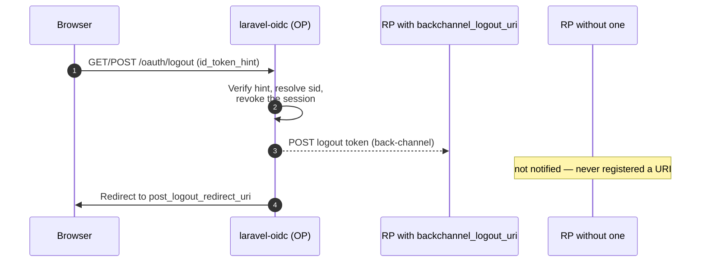

## RP-initiated logout (`/oauth/logout`)

The end-session endpoint implements OpenID Connect RP-Initiated Logout 1.0. It accepts `GET` and
`POST` with the §2 parameters `id_token_hint`, `client_id`, `post_logout_redirect_uri`, `state`,
`logout_hint` and `ui_locales`; the last two are accepted and ignored.

### Identifying the relying party

The relying party is the client the verified `id_token_hint` (signature and issuer checked) was
issued to — its `aud` — or, without a hint, the client named by `client_id`. When both are given
and `client_id` is not in the hint's `aud`, the request is answered with `400 invalid_request`.

`post_logout_redirect_uri` is only honored when it is registered on that client
(`oidc_clients.post_logout_redirect_uris`); otherwise the browser lands on the fallback
(`oidc.login.logout_redirect`). Without a hint or a `client_id` there is no client to validate
against, so the fallback is always used. When present, `state` is appended to the redirect.

### Threat model

RP-initiated logout is a known CSRF surface (a forged `GET` can log a victim out), so the session
is only ended when the request proves the End-User's intent:

- **Valid `id_token_hint` naming the signed-in user** (or nobody signed in) → log out and redirect.
  A hint whose `sub` is somebody else is treated like no hint.
- **`POST`** → log out and redirect. `POST` passes through the `web` group's CSRF protection, so it
  is same-site. A `POST` carrying `logout_confirmation` is the confirmation flow below.
- **`GET` without a verifiable hint** → ask the signed-in user (§6) when a
  `LogoutConfirmationView` is bound; otherwise **do not log out** and redirect to the fallback.
  A signed-out browser has nothing to end and is redirected as though the logout happened.

### Confirmation view

`Bambamboole\LaravelOidc\Server\Sessions\Views\LogoutConfirmationView` is the view seam for the
§6 prompt, bound like the other auth views (the ui package binds a page; without a binding the
contract throws `MissingAuthViewException`, which the endpoint treats as "no view", keeping the
fallback above). It receives a `LogoutPrompt`:

```php
final readonly class LogoutPrompt
{
    public Authenticatable $user;
    public ?Client $client;                 // the relying party, when the request identified one
    public ?string $postLogoutRedirectUri;  // validated; null means the fallback
    public ?string $state;
    public string $confirmationToken;
}
```

The page posts `logout_confirmation` back to `/oauth/logout`. The token seals the
validated target with the application encrypter, bound to the prompted user and valid for ten
minutes; a token for another user, a tampered one or an expired one is `400 invalid_request`.
`FakesAuthViews` binds a JSON stub for it, like for every other view.

### Which session is ended

The `EndSession` action logs the identity guard out and invalidates the browser session. The
`Logout` event listener (`EndOidcSession`) revokes the OIDC session recorded in that browser
session and dispatches the back-channel notifications — once, whichever path triggered the
logout. The hint identifies the user, not the session: an OIDC session the browser no longer
carries is ended by its absolute lifetime and `oidc:dispatch-expired-session-logouts`.

### Ending a session from elsewhere

An OIDC session records the id of the browser session its login happened in (`session_id` on
`oidc_sessions`). An account page that lists a user's browser sessions can end the OIDC session
behind one of them without reading the session payload:

```php
$sessions = app(OidcSessionRepository::class);
$session = $sessions->findByBrowserSession($browserSessionId);

if ($session !== null) {
    $sessions->revoke($session->sid);
    app(BackChannelLogoutNotifier::class)->notify($session->sid);
}
```

The lookup is scoped to the current realm, like `find()`.

### Residual risk (accepted by design)

A valid authorization request carrying `max_age=0` forces re-authentication for an
already-authenticated victim. The request must pass validation first — an active `client_id`, a
registered `redirect_uri`, `response_type=code` and a PKCE challenge — but all of that is
constructible for a public client, whose ids and redirect URIs are discoverable. This is inherent
to honoring `max_age` at the authorization endpoint — the effect is a forced re-login, never
account compromise.

## Back-channel logout

The provider **does** implement OIDC back-channel logout. When a session is destroyed at the
end-session endpoint, or when a session hits its absolute lifetime, the OP notifies every relying
party that participated in that session.



- Back-channel logout is **opt-in per relying-party client**: a client only receives it if it has
  registered a `backchannel_logout_uri`.
- On logout — at `/oauth/logout` or through the application's own logout — the
  `Logout` event listener reads the session's `sid`, the session registry revokes it, and a logout
  token is dispatched to each participant.
- For sessions that expire by reaching their absolute lifetime rather than an explicit logout, the
  `oidc:dispatch-expired-session-logouts` command sends the back-channel notifications. This
  command must run ahead of context pruning so no expired session's row is removed before its
  participants are notified — see [Scheduled maintenance](/provider/scheduled-maintenance/).

Discovery advertises `backchannel_logout_supported: true` and
`backchannel_logout_session_supported: true`.
