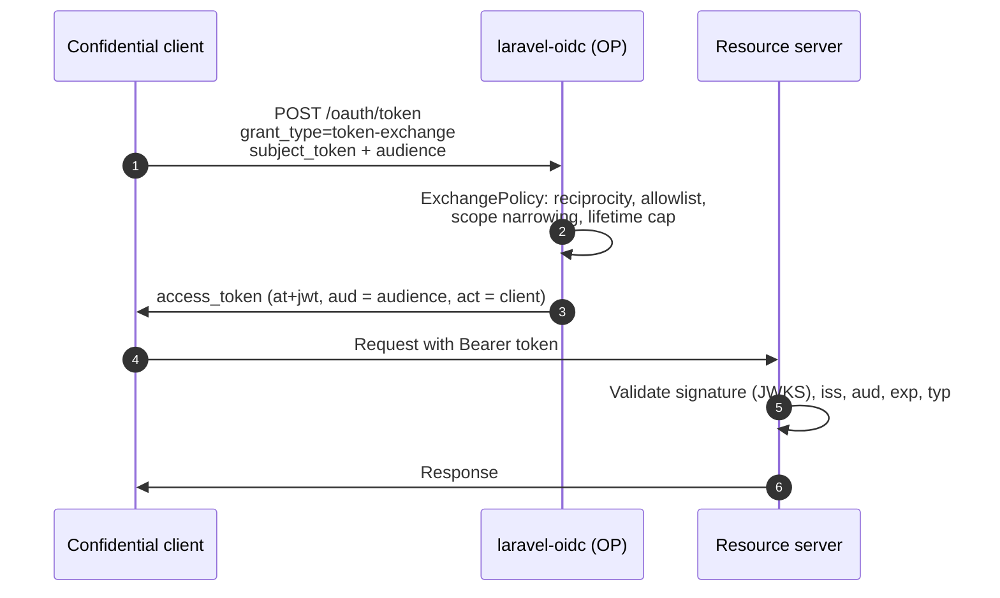

The provider optionally supports [RFC 8693](https://www.rfc-editor.org/rfc/rfc8693) token
exchange: a confidential client trades a token it already holds for a new access token scoped to a
different `aud` (audience), typically to call a downstream resource server. It is gated behind
`config('oidc.token_exchange.enabled')` (default `true`; `OIDC_TOKEN_EXCHANGE_ENABLED`), advertised
in discovery's `grant_types_supported` when enabled, and registered under the grant identifier:

```text
urn:ietf:params:oauth:grant-type:token-exchange
```



## Enabling it per client

A client must opt in on two columns of `oauth_clients` (added by this package's migration):

```php
$client->forceFill([
    'grant_types' => [...$client->grant_types, 'urn:ietf:params:oauth:grant-type:token-exchange'],
    'allowed_exchange_audiences' => json_encode(['https://api.internal/orders']),
])->save();
```

- `grant_types` must include the exchange URN, or the token endpoint rejects the client with
  `invalid_client`.
- `allowed_exchange_audiences` is a JSON array of audience strings the client is permitted to
  request. Anything outside it is rejected.

## Request and response

```text
POST /oauth/token
grant_type=urn:ietf:params:oauth:grant-type:token-exchange
client_id=...
client_secret=...
subject_token=<access_token to exchange>
subject_token_type=urn:ietf:params:oauth:token-type:access_token
audience=https://api.internal/orders
scope=orders:read          # optional
```

Only `subject_token_type=urn:ietf:params:oauth:token-type:access_token` is supported (and, if
given, `requested_token_type` must also be the access-token URN); anything else is rejected with
`invalid_request`.

```json
{
    "access_token": "eyJ...",
    "issued_token_type": "urn:ietf:params:oauth:token-type:access_token",
    "token_type": "Bearer",
    "scope": "orders:read"
}
```

There is **no `refresh_token`** in the response — the grant never mints one. The issued access
token is the same RFC 9068 `at+jwt` format described under
[Access tokens](/provider/access-tokens/), with `aud` set to the requested `audience` and an `act`
claim (`{"client_id": "..."}`) identifying the exchanging client as the actor.

## Guarantees

- No refresh token is ever issued from this grant.
- The exchanged token's subject (`sub`) is always identical to the subject token's.
- The exchanged token's lifetime never exceeds the subject token's remaining lifetime.
- Revoking a subject token does **not** cascade to already-issued exchanged tokens: each exchanged
  token remains valid until its own `exp` (capped at the subject's `exp`) or until it is
  independently revoked.

## The `ExchangePolicy` contract

Every exchange request is authorized by `Bambamboole\LaravelOidc\Contracts\ExchangePolicy`, bound
by default to `DefaultExchangePolicy`:

```php
namespace Bambamboole\LaravelOidc\Contracts;

use Bambamboole\LaravelOidc\Exchange\ExchangeGrantResult;
use Bambamboole\LaravelOidc\Exchange\ExchangeRequest;

interface ExchangePolicy
{
    public function authorize(ExchangeRequest $request): ExchangeGrantResult;
}
```

`ExchangeRequest` carries the requesting `client`, the subject token's decoded `subjectClaims`, the
requested `audience`/`scopes`, and the subject token's `subjectExpiresAt`. `authorize()` must
either return an `ExchangeGrantResult` (`userId`, `scopes`, `audience`, `expiresAt`) or throw a
`League\OAuth2\Server\Exception\OAuthServerException` to fail the exchange with a specific
RFC-shaped error. Replace the default to add tenant checks, custom scope rules, or a different
allowlist source:

```php
use Bambamboole\LaravelOidc\Contracts\ExchangePolicy;
use Bambamboole\LaravelOidc\Exchange\ExchangeGrantResult;
use Bambamboole\LaravelOidc\Exchange\ExchangeRequest;
use League\OAuth2\Server\Exception\OAuthServerException;

class TenantScopedExchangePolicy implements ExchangePolicy
{
    public function authorize(ExchangeRequest $request): ExchangeGrantResult
    {
        if (($request->subjectClaims['tenant_id'] ?? null) !== $request->client->tenant_id) {
            throw OAuthServerException::accessDenied('Cross-tenant exchange is not permitted.');
        }

        // ... reuse or reimplement the reciprocity/allowlist/scope checks below ...

        return new ExchangeGrantResult(
            userId: (string) $request->subjectClaims['sub'],
            scopes: $request->requestedScopes ?? [],
            audience: [$request->requestedAudience],
            expiresAt: $request->subjectExpiresAt,
        );
    }
}
```

```php
$this->app->singleton(ExchangePolicy::class, TenantScopedExchangePolicy::class);
```

### `DefaultExchangePolicy` rules

1. **Audience reciprocity.** The requesting client must be the one the subject token was issued to
   or for: either the client's id is present in the subject token's `aud`, or the subject token's
   `client_id` claim matches. Otherwise `access_denied`.
2. **Target allowlist.** The requested `audience` must be one of the requesting client's
   `allowed_exchange_audiences`. Otherwise `invalid_target` (400).
3. **Scope narrowing.** Requested scopes (defaulting to the subject token's own scopes when `scope`
   is omitted) must be a subset of the subject token's scopes — exchange can only narrow, never
   widen. A scope not held by the subject token fails with `invalid_scope`.
4. **Same subject.** The exchanged token's `sub` is always the subject token's own `sub` claim.
   There is no actor/impersonation parameter — a client can narrow and re-target its own subject's
   token, not mint a token for a different user.
5. **Lifetime cap.** The exchanged token's expiry is capped at the *earlier* of the server's
   configured access-token TTL and the subject token's own `exp`; an exchanged token never
   outlives the token it was derived from.

Independently of the policy, the grant itself rejects an **expired or revoked subject token**, and
a subject token that is **not bound to a user** (e.g. a client-credentials token whose `sub` is a
client id), with `invalid_grant` — before the policy ever runs. The exchange design assumes a user
subject.

## Consuming exchanged tokens

Exchanged tokens are validated on the resource server like any RFC 9068 access token — see
[Resource servers](/advanced/resource-servers/). The same grant logic also powers the in-process
per-audience token minting used by the [browser-fetch model](/advanced/browser-fetch/).
